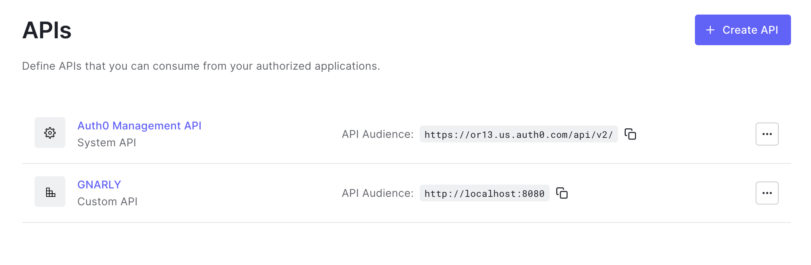
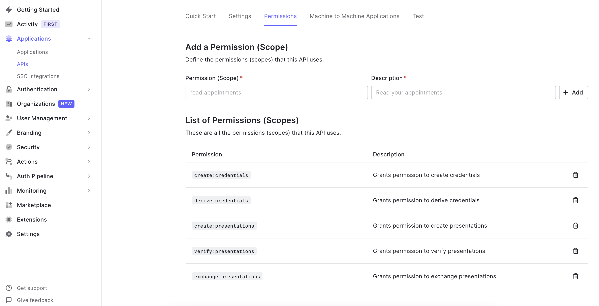
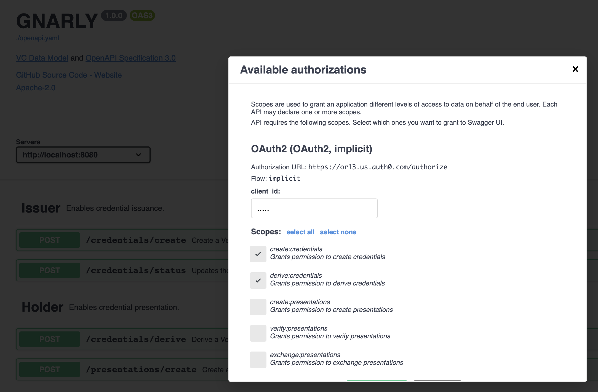

### GNARYLY

[VC Data Model + OAS 3.0 + OAuth2](https://gnarly.or13.io)

This repo was created to as a proposal for changes to the VC-HTTP-API.

Main improvements over the current API:

1. Supports VC-JWT
1. Supports JsonWebSignature2020
1. Supports Authorization
1. Supports BBS+ Selective Disclosure Presentation Exchange

#### API Documentation

```
npm run build:docs
npm run serve:docs
```

Visit [http://localhost:5000](http://localhost:5000)

#### Setting Up Authorization

1. Create an API in Auth0



2. Create an Scopes in Auth0 from the OAS 3.0 Spec guidelines



3. Configure OAS 3.0 YAML to use Auth0


